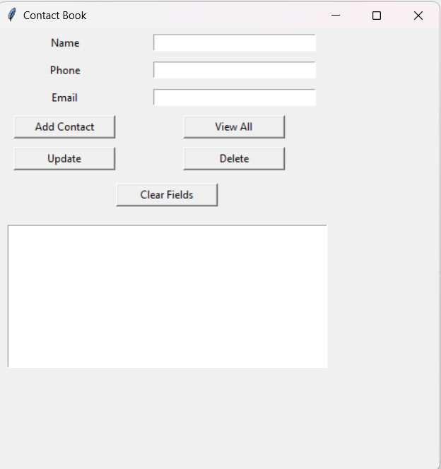

```markdown
# Contact Book Application using Python (Tkinter + SQLite)

A beginner-friendly desktop application built using Python’s Tkinter library and SQLite database. This contact management tool allows users to perform all CRUD operations (Create, Read, Update, Delete) on a local database through a simple graphical interface.

---

## Features

- ➕ Add new contacts (Name, Phone, Email)
- 📖 View all saved contacts in a list
- ✏️ Update existing contact information
- ❌ Delete selected contact
- 🔄 Clear input fields
- 💾 Persistent storage using SQLite

---

## Technologies Used

| Technology | Description |
|------------|-------------|
| Python | Programming Language |
| Tkinter | GUI library in Python |
| SQLite3 | Lightweight relational database embedded with Python |

---

## Project Structure

```

contact-book/
├── contact\_book.py        # Main application script
├── contact\_book.db        # SQLite database file (auto-generated)
├── screenshots/
│   └── ui.png             # UI screenshot (create manually)
└── README.md              # Project documentation

````

---

## Objectives

- Learn GUI design with `Tkinter`
- Integrate `SQLite` database for backend
- Implement full CRUD operations
- Develop a mini desktop application project

---

## Why SQLite?

SQLite is:
- Embedded and serverless — no setup required
- Lightweight and easy to use
- Perfect for small-scale desktop apps
- Comes built-in with Python (`sqlite3` module)

---

## How to Run

1. Clone the repository:

```bash
git clone https://github.com/your-username/contact-book.git
cd contact-book
````

2. Run the application:

```bash
python contact_book.py
```

3. The GUI window will appear. Start adding and managing contacts!

---

## Screenshot



---

## Example Workflow

1. Enter Name, Phone, and Email
2. Click **Add Contact**
3. Contact shows in the listbox
4. Select a contact → fields auto-fill
5. Update or Delete as needed
6. Use **Clear** to reset the input form

---

## Learning Outcomes

* GUI programming with `Tkinter`
* SQL integration using `sqlite3`
* Event-driven programming
* Full CRUD lifecycle in a Python app
* Python function organization and input validation

---


## Author

**Anshuman**
Python Developer | Beginner in GUI Programming
🔗 [GitHub](https://github.com/your-username)
📧 [your-email@example.com](mailto:your-email@example.com)

---

## License

This project is licensed under the [MIT License](LICENSE).

```

---

📌 **Replace** the GitHub link, email, and screenshot path (`ui.png`) as per your actual project setup.
```
